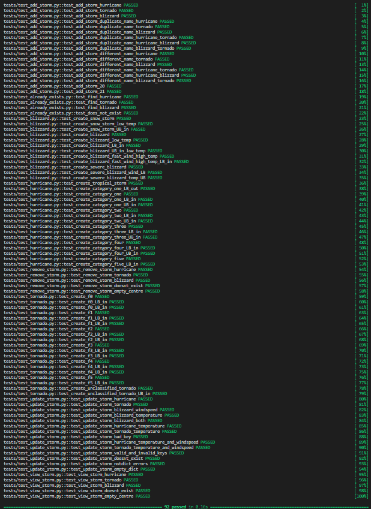

# Part 2
## Assumptions
- Wind speeds can only be integers: it is not type-hinted, but the range() function is used.
- I do not need to test for negative (or other unreasonable) inputs: logical, but not specified in the brief or attempted anywhere in the code.
- I do not need to type check (except for a dictionary in update_storm): There is very little type hinting or attempt to type check throughout the code and I assume this is not intended to be a large number of the same bug.
- update_storm is for updating temperature and windspeed: Both of these might change. Name shouldn't

## Initial bug fixes
I think the below errors were just my linter being strict so I made some initial changes to prevent this from being an issue before starting testing, which I have outlined below.

### Type hinting Storm
```python
    @abstractmethod
    def calculate_classification(self) -> str: # type hint
        pass

    @abstractmethod
    def get_advice(self) -> str: #type hint
        pass
```

### Replacing 'or' with '|'
```python
def view_storm(self, name: str) -> Storm | None: #replace "or" with "|"
        for storm in self.storm_list:
            if storm.name == name:
                return storm
        return None
```

## Hurricane
### Fail 1

```python
def test_create_tropical_storm():
    hurricane = Hurricane("Amy", 70)
    assert hurricane.calculate_classification() == "Tropical Storm"
    assert hurricane.get_advice() == "Close storm shutters and stay away from windows"
```
Issue: Identifying Tropical Storms as "Unclassified"
Fix: Set default to Tropical Storm
```python
def calculate_classification(self) -> str:
        if self.wind_speed in range(74, 95):
            return "Category one"
        elif self.wind_speed in range(96, 111):
            return "Category two"
        elif self.wind_speed in range(111, 130):
            return "Category three"
        elif self.wind_speed in range(130, 157):
            return "Category four"
        elif self.wind_speed > 156:
            return "Category five"
        return "Tropical Storm" # replaced "Unclassified" with "Tropical Storm"
```


### Fail 2

```python
def test_create_category_one_UB_in():
    hurricane = Hurricane("Bram", 95)
    assert hurricane.calculate_classification() == "Category one"
    assert hurricane.get_advice() == "Close storm shutters and stay away from windows"
```
Issue: Upper bound for category 1 not inside bound
Fix: Use exclusive upper bound
```python
    def calculate_classification(self) -> str:
        if self.wind_speed in range(74, 96): # replaced 95 with 96
            return "Category one"
        elif self.wind_speed in range(96, 111):
            return "Category two"
        elif self.wind_speed in range(111, 130):
            return "Category three"
        elif self.wind_speed in range(130, 157):
            return "Category four"
        elif self.wind_speed > 156:
            return "Category five"
        return "Tropical Storm" # replaced "Unclassified" with "Tropical Storm"
```


## Tornado
### Fail 1

```python
def test_create_f0_LB_in():
    tornado = Tornado("Gerard", 40)
    assert tornado.calculate_classification() == "F0"
    assert tornado.get_advice() == "Find safe room/shelter, shield yourself from debris"
```
Issue: Lower bound for f0 not inside bound
Fix: Use less than
```python
def calculate_classification(self) -> str:
        if self.wind_speed < 40: # changed <= to <
            return "Unclassified"
        elif self.wind_speed <= 72:
            return "F0"
        elif self.wind_speed in range(73, 113):
            return "F1"
        elif self.wind_speed in range(113, 158):
            return "F2"
        elif self.wind_speed in range(158, 206):
            return "F3"
        elif self.wind_speed in range(206, 261):
            return "F4"
        elif self.wind_speed >= 261:
            return "F5"
        return "Unclassified"
```


### Fail 2

```python
def test_create_f4():
    tornado = Tornado("Kasia", 250)
    assert tornado.calculate_classification() == "F4"
    assert tornado.get_advice() == "Find underground shelter, crouch near to the floor covering your head with your hands"
```
Issue: F4 in wrong group
Fix: Add comma
```python
def get_advice(self) -> str:
        classification = self.calculate_classification()

        if classification in ["Unclassified", "F0", "F1"]:
            return "Find safe room/shelter, shield yourself from debris"
        elif classification in ["F2", "F3", "F4", "F5"]: # added comma between "F4" and "F5"
            return "Find underground shelter, crouch near to the floor covering your head with your hands"
        return "There is no need to panic"
```


### Fail 3

```python
def test_create_unclassified_tornado():
    tornado = Tornado("Marty", 0)
    assert tornado.calculate_classification() == "Unclassified"
    assert tornado.get_advice() == "There is no need to panic"
```
Issue: Unclassified in wrong group
Fix: Remove "Unclassified" from wrong group
```python
def get_advice(self) -> str:
    classification = self.calculate_classification()

    if classification in ["F0", "F1"]: # removed "Unclassified"
        return "Find safe room/shelter, shield yourself from debris"
    elif classification in ["F2", "F3", "F4", "F5"]: # added comma between "F4" and "F5"
        return "Find underground shelter, crouch near to the floor covering your head with your hands"
    return "There is no need to panic"
```


## Blizzard
### Fail 1

```python
def test_create_blizzard():
    blizzard = Blizzard("Oscar", 40, 10)
    assert blizzard.calculate_classification() == "Blizzard"
    assert blizzard.get_advice() == "Keep warm, Do not travel unless absolutely essential."
```
Issue: "Blizzard" is not capitalised
Fix: Capitalise it
```python
def calculate_classification(self) -> str:
    if self.wind_speed >= 35:
        return "Blizzard" # capitalised "blizzard"
    elif self.wind_speed >= 45 and self.temp <= -12:
        return "Severe Blizzard"
    return "Snow Storm"
```

Initial issue was fixed.
New issue: Blizzard in wrong category
Fix: Create category for blizzard
```python
def get_advice(self) -> str:
    classification = self.calculate_classification()

    if classification == "Severe Blizzard":
        return "Keep warm, avoid all travel."
    # inserted below condition for Blizzard
    elif classification == "Blizzard":
        return "Keep warm, Do not travel unless absolutely essential."
    return "Take care and avoid travel if possible."
```


### Fail 2

```python
def test_create_severe_blizzard():
    blizzard = Blizzard("Patrick", 400, -100)
    assert blizzard.calculate_classification() == "Severe Blizzard"
    assert blizzard.get_advice() == "Keep warm, avoid all travel."
```
Issue: Severe Blizzard not being identified
Fix: Check for Severe Blizzard before Blizzard
```python
def calculate_classification(self) -> str:
    if self.wind_speed >= 45 and self.temp <= -12: # moved this condition to top
        return "Severe Blizzard"
    elif self.wind_speed >= 35:
        return "Blizzard" # capitalised "blizzard"
    return "Snow Storm"
```


## Add storm
### Fail 1

```python
def test_add_storm_duplicate_name_different_type(storm_centre):
    storm_centre.add_storm(Hurricane("Ruby", 100))
    assert storm_centre.add_storm(Tornado("Ruby", 10)) == False
```
Issue: Duplicate name allowed when one of the types is a Hurricane
Fix: Correctly assign name in Hurricane
```python
def __init__(self, name, wind_speed):
        super().__init__(name, wind_speed) # replaced "none" with name
```


I noticed another issue while debugging this. The type check on add_storm always returns true. It wouldn't have been caught in a unit test, as there are only 3 children of Storm and they are all valid (and Storm is abstract so cannot be created alone). I have fixed it below.
```python
def add_storm(self, storm: Storm) -> bool:
    if (len(self.storm_list) <= 20
            and (isinstance(storm, Blizzard) or isinstance(storm, Tornado) or isinstance(storm, Hurricane)) # fixed this check
            and not self.already_exists(storm.name)): # refactored this line for ease of reading
        self.storm_list.append(storm)
        return True
    return False
```
All the existing tests passed after this change.

### Fail 2

```python
def test_add_storm_21(storm_centre):
    for i in range(20):
        assert storm_centre.add_storm(Hurricane(str(i), 100)) == True
    assert storm_centre.add_storm(Hurricane("21", 100)) == False
```
Issue: More than 20 storms can be added
Fix: Ensure less than 20 storms are in centre before adding
```python
def add_storm(self, storm: Storm) -> bool:
    if (len(self.storm_list) < 20 # changed <= to <
            and (isinstance(storm, Blizzard) or isinstance(storm, Tornado) or isinstance(storm, Hurricane))
            and not self.already_exists(storm.name)):
        self.storm_list.append(storm)
        return True
    return False
```


## Remove storm
### Fail 1

```python
def test_remove_storm_doesnt_exist(full_storm_centre):
    assert full_storm_centre.remove_storm("hello") == False
```
Issue: Does not indicate if removed storm not found
Fix: Make return value conditional
```python
def remove_storm(self, name: str) -> bool:
    for storm in self.storm_list:
        if name == storm.name:
            self.storm_list.remove(storm)
            return True # made this conditional
    return False # added default false return
```


## Update storm
I have created a helper function to test whether storms are equivalent
```python
def _equivalent(actual: Storm, expected: Storm) -> bool:
    if type(actual) != type (expected):
        return False
    if type(actual) == Blizzard and type(expected) == Blizzard:
        if (actual.wind_speed == expected.wind_speed
            and actual.temp == expected.temp
            and actual.name == expected.name):
            return True
        return False
    else:
        if (actual.wind_speed == expected.wind_speed
            and actual.name == expected.name):
            return True
        return False
```

### Fail 1

```python
def test_update_storm_blizzard_temperature(full_storm_centre):
    changes = {
        "temperature" : 30
    }
    assert full_storm_centre.update_storm("Ashley", changes) == True
    actual = full_storm_centre.view_storm("Ashley")
    expected = Blizzard("Ashley", 25, 30)
    assert _equivalent(actual, expected) == True
```
Issue: Update method using windspeed when it is not given
Fix: Make update conditional
```python
def update_storm(self, name, values) -> bool:
    if isinstance(values, dict):
        for storm in self.storm_list:
            if storm.name == name:
                if ("windspeed" in values): # added condition
                    storm.wind_speed = values["windspeed"]
                    return True
    else:
        raise Exception("Values must be provided as a dictionary")
    return False
```

Initial issue was fixed.
New issue: Updating the temperature does not work
Fix: Add condition to update temperature
```python
def update_storm(self, name, values) -> bool:
    if isinstance(values, dict):
        for storm in self.storm_list:
            if storm.name == name:
                if ("temperature" in values): # added condition for temperature
                    if isinstance(storm, Blizzard):
                        storm.temp = values["temperature"]
                    else:
                        return False
                if ("windspeed" in values): # added condition
                    storm.wind_speed = values["windspeed"]
    else:
        raise Exception("Values must be provided as a dictionary")
    return True # replaced default with True and use False returns for error
```


### Fail 2

```python
def test_update_storm_nonexistent(full_storm_centre):
    changes = {
        "hello" : 30
    }
    assert full_storm_centre.update_storm("Violet", changes) == False
    actual = full_storm_centre.view_storm("Violet")
    expected = Hurricane("Violet", 25)
    assert _equivalent(actual, expected) == True
```
Issue: Update returning true when key is invalid
Fix: Add check for valid keys only
```python
def update_storm(self, name, values) -> bool:
    if isinstance(values, dict):
        if (not (set(values.keys()).issubset({"temperature", "windspeed"}))): # added check for valid keys
            return False
        for storm in self.storm_list:
            if storm.name == name:
                if ("temperature" in values): # added condition for temperature
                    if isinstance(storm, Blizzard):
                        storm.temp = values["temperature"]
                    else:
                        return False
                if ("windspeed" in values): # added condition
                    storm.wind_speed = values["windspeed"]
    else:
        raise Exception("Values must be provided as a dictionary")
    return True # replaced default with True and use False returns for errors
```


### Fail 3

```python
def test_update_storm_doesnt_exist(full_storm_centre):
    changes = {
        "temperature" : 30
    }
    assert full_storm_centre.update_storm("hello", changes) == False
    actual_violet = full_storm_centre.view_storm("Violet")
    actual_wubbo = full_storm_centre.view_storm("Wubbo")
    actual_ashley = full_storm_centre.view_storm("Ashley")
    expected = [Hurricane("Violet", 25), Tornado("Wubbo", 25), Blizzard("Ashley", 25, -12)]
    assert _equivalent(actual_violet, expected[0]) == True
    assert _equivalent(actual_wubbo, expected[1]) == True
    assert _equivalent(actual_ashley, expected[2]) == True
```
Issue: Not returning False when updating storm which doesn't exist
Fix: Check storm exists before updating
```python
def update_storm(self, name, values) -> bool:
    if isinstance(values, dict):
        if (not self.already_exists(name)): # added check for storm existence
            return False
        if (not (set(values.keys()).issubset({"temperature", "windspeed"}))): # added check for valid keys
            return False
        for storm in self.storm_list:
            if storm.name == name:
                if ("temperature" in values): # added condition for temperature
                    if isinstance(storm, Blizzard):
                        storm.temp = values["temperature"]
                    else:
                        return False
                if ("windspeed" in values): # added condition
                    storm.wind_speed = values["windspeed"]
    else:
        raise Exception("Values must be provided as a dictionary")
    return True # replaced default with True and use False returns for errors
```


### Fail 4

```python
def test_update_storm_empty_dict(full_storm_centre):
    changes: dict = {}
    assert full_storm_centre.update_storm("Violet", changes) == False
    actual = full_storm_centre.view_storm("Violet")
    expected = Hurricane("Violet", 25)
    assert _equivalent(actual, expected) == True
```
Issue: Update with an empty dict returns True
Fix: Add check for empty dict
```python
def update_storm(self, name, values) -> bool:
    if isinstance(values, dict):
        if (not self.already_exists(name)): # added check for storm existence
            return False
        if (not (set(values.keys()).issubset({"temperature", "windspeed"})) # added check for valid keys
            or len(values.keys()) == 0): # added check for empty dict
            return False
        for storm in self.storm_list:
            if storm.name == name:
                if ("temperature" in values): # added condition for temperature
                    if isinstance(storm, Blizzard):
                        storm.temp = values["temperature"]
                    else:
                        return False
                if ("windspeed" in values): # added condition
                    storm.wind_speed = values["windspeed"]
    else:
        raise Exception("Values must be provided as a dictionary")
    return True # replaced default with True and use False returns for errors
```


## All tests
